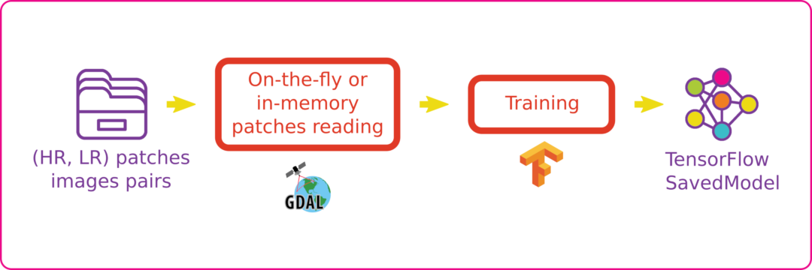
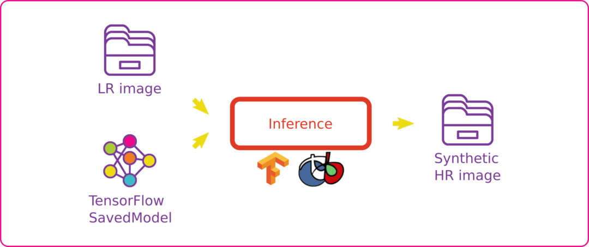

# SR4RS Documentation

## References

This code is largely inspired from the following work. Big up to these guys.

Ledig et Al. (general approach, perceptive loss)
```
@inproceedings{ledig2017photo,
  title={Photo-realistic single image super-resolution using a generative adversarial network},
  author={Ledig, Christian and Theis, Lucas and Husz{\'a}r, Ferenc and Caballero, Jose and Cunningham, Andrew and Acosta, Alejandro and Aitken, Andrew and Tejani, Alykhan and Totz, Johannes and Wang, Zehan and others},
  booktitle={Proceedings of the IEEE conference on computer vision and pattern recognition},
  pages={4681--4690},
  year={2017}
}
```

Karras et Al. (mini batch discrimination, equalized learning rate, WGAN-WP tweaks)

```
@article{karras2017progressive,
  title={Progressive growing of gans for improved quality, stability, and variation},
  author={Karras, Tero and Aila, Timo and Laine, Samuli and Lehtinen, Jaakko},
  journal={arXiv preprint arXiv:1710.10196},
  year={2017}
}
```

Karnewar et Al. (multi scale gradient)
```
@article{karnewar2019msg,
  title={MSG-GAN: multi-scale gradient GAN for stable image synthesis},
  author={Karnewar, Animesh and Wang, Oliver},
  journal={arXiv preprint arXiv:1903.06048},
  year={2019}
}
```

## How to install

Use the [OTBTF Docker image](https://github.com/remicres/otbtf#how-to-install) with version >= 2.0.
Clone this repository anywhere inside your docker.

## How to use

### Step 1: prepare your patches images

Patches images consist of images of size `nrows x ncols x nbands`, like the ones produced using OTBTF's `PatchesExtraction` application.

Typically, you need to create patches for the low-resolution image (LR) and for the high-resolution image (HR), each patch being at the same location.
Here is an example using the OTB command line interface:

```
OTB_TF_NBSOURCES=2 otbcli_PatchesExtraction \
-source1.il Sentinel-2_B4328_10m.tif \
-source1.patchsizex 32 \
-source1.patchsizey 32 \
-source1.out lr_patches.tif int16 \
-source2.il Spot6_pansharp_RGBN_2.5m.tif \
-source2.patchsizex 128 \
-source2.patchsizey 128 \
-source2.out hr_patches.tif int16 \
-vec patches_center_locations.shp \
-field "fid"
```

Here, `patches_center_locations.shp` is a vector layer of points (each point locates one patch center). 
You can generate this layer using QGIS tool _vector > search tools > create grid_ to create a square grid, then select the polygons centroïds using QGIS tool _vector > geometry > centroids_ for instance.
Here `fid` must be an existing field in the `patches_center_locations.shp` (values are not used, but the field must exist though! you can use any existing field here).
Note that we do not normalize or change anything in the images dynamics (encoding is still 16 bits).
The LR and HR images have the same number of bands, ordered in the same following fashion: Red=channel1, Green=channel2, Blue=channel3 (you can add some other spectral bands after the 3rd channel, but they must be in the same order in both LR and HR images. For instance here we put the near infrared band as the 4th channel).

### Step 2: train your network



Use `train.py` to train a super-resolution network and export the SavedModel.
**A (known bug)[https://github.com/remicres/sr4rs/issues/36] affects the training when `--streaming` is not used, for OTBTF versions < 2.5. Use `--streaming` in this case!**
Well, here you might want to play with the parameters. The result will depend likely on your images!
Play with `l1weight`, `l2weight`, `vggweight` (if you provide the VGG weights).
Check in tensorboard the dynamic of your losses during training, and of course the preview image.

Here are the parameters of the application:
- `lr_patches` the LR image patches (in our example, `lr_patches.tif`)
- `hr_patches` the HR image patches (in our example, `hr_patches.tif`)
- `preview` an optional LR image subset, for a preview in tensorboard. You can use `ExtractROI` application from OTB to extact a small subset from your LR image. Be carefull not to set a too big preview image! Think that the resulting image will be 4 time bigger.
- `logdir` the directory in where the tensorboard files will be generated
- `save_ckpt` save the checkpoint here
- `load_ckpr` load the checkpoint here instead of training from scratch
- `savedmodel` the output SavedModel that will be generated, and that will be used later for generating fake HR images
- `vggfile` path to the VGG weights (`vgg19.npy` file, available everywhere on the internet)
- `lr_scale` set this coefficient to scale your LR images between [0, 1] at model input. The coefficient multiplies the original image. For instance, 0.0001 is good for 12 bits sensors. You can use `gdalinfo -stats` to check what is the max value in your images.
- `hr_scale` set this coefficient to scale your HR images between [0, 1] (Like `lr_scale`)
- `depth` base depth of the network
- `nresblocks` number of residual blocks in the network
- `batchsize` batch size. Must be >= 3 because we use mini-batch statistics for training discriminator (see Karas et al).
- `adam_lr` adam learning rate
- `adam_b1` adam beta 1
- `l1weight` L1 norm weight in the loss function
- `l2weight` L2 norm weight in the loss function
- `vggweight` perceptual loss weight in the loss function
- `vggfeatures` VGG features to use to compute the perceptual loss
- `losstype` GAN loss type
- `streaming` select `--streaming` to read patches images on the fly, from the filesystem. This limits the RAM used, but stresses the filesystem.
- `pretrain` select `--pretrain` if you want to pre-train the network using only L1 or L2 losses (`l1weight` and `l2weight` values are used for this).

Here is an example:
```
python train.py \
--lr_patches lr_patches.tif --hr_patches hr_patches.tif --preview lr_subset.tif \
--vggfile /path/to/vgg19.npy \ 
--save_ckpt /path/to/results/ckpts/ --logdir /path/to/results/logs/ \
--vggweight 0.00003 --l1weight 200 --l2weight 0.0 \
--depth 64 --vggfeatures 1234 --batchsize 4 --adam_lr 0.0002 \
--lr_scale 0.0001 --hr_scale 0.0001 \
--savedmodel /path/to/savedmodel
```
These settings helped to generate good looking images from our Sentinel-2 products. 
Since this is quite subjective, other settings might be better suited, depending on your images.
The important thing is, after the training is complete, the SavedModel will be generated in `/path/to/savedmodel`.
Take care not to use an existing folder for `--savedmodel`, else TensorFlow will cancel the save. You must provide a non-existing folder for this one.
Note that you can provide multiple HR and LR patches: just be sure that there is the same number of patches images, in the same order. Use the `--streaming` option if this takes too much RAM.

#### How to chose the training parameters?

Here are a few rules of thumb to follow:
- use `lr_scale` and `hr_scale` so that the images pixels values range is generally in the [0, 1] interval,
- use small `depth` and `nresblocks` to train a small model: this would be useful if you have small dataset, or low GPU memory budget.
- Play with `batchsize` and `adam_lr` to train your model. The outcome mostly depends on the distribution of your data. Generally, a small batch size helps (4, 8, 16) and a learning rate in the 10e-2 and 10e-5 range.
- `l1weight`, `l2weight`, `vggweight`: tune these parameters so that their contribution is in the same magnitude as the GAN loss.

### Step 3: generate your fake HR images



Now we use OTBTF `TensorFlowModelServe` application through `sr.py`.
We just apply our SavedModel to a LR image, and transform it in a fake HR image.
```
python sr.py \
--input Sentinel-2_B4328_10m.tif \
--savedmodel /path/to/savedmodel \
--output Sentinel-2_B4328_2.5m.tif
```

#### Useful parameters

- Depending on your hardware, you can set the memory footprint using the parameter `--ts` (as **t**ile **s**ize). Use large tile size to speed-up the process. If the tile size is too large, TensorFlow will likely throw an OOM (out of memory) exception. **Note the the default value (512) is quite small, and you will like to manually change that value to gain a great speed-up** for instance on an old GTX1080Ti (12Gb RAM) you can use 1024.
- Change the output image encoding using the `--encoding` parameter. e.g for Sentinel-2 images you can use `--encoding int16`.
- The image generation process avoids blocking artifacts in the generated output image. Use the `--pad` parameter to change the margin used to keep the pseudo-valid region, in spatial dimensions, of the output tensor.

